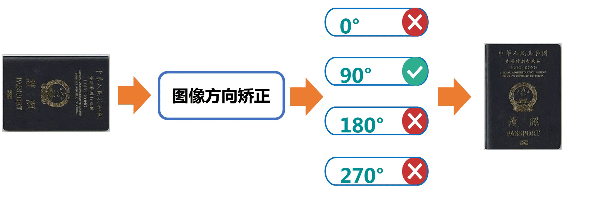

# EasyData

## 简介

EasyData旨在打造一套通用、领先且实用的数据自动扩充与数据质量优化工具库，并提供开源数据集与标注工具大全，助力开发者获得高质量的训练、推理数据，从而提升AI算法的实用效果。

Todo : 挑选并合成可视化的效果图。

|             PP-LDI数据质量提升效果图             |
| :----------------------------------------------------: |
|  |

[EDA数据合成效果图@晓婷]

[数据集/标注工具效果图@赵军]

## 📣 近期更新

Todo: 参照PaddleOCR等套件，补齐直播预告和工具说明

- **💥 直播预告**，todo@赵军 

- **🔥2022.11 发布 EasyData beta/0.5**
  - 发布数据质量提升工具，包括图像方向矫正、低质图像过滤能力，使用该工具可以在多个视觉任务中提升效果。
  - 发布数据合成工具，支持增广数据生成、重复和低质数据过滤，使用该工具可以在整图识别场景中提升效果。
  - 发布开源数据集和标注工具大全@赵军

## ⚡ 快速开始

- [数据质量提升快速体验](docs/zh_CN/PP-LDI/quick_start.md)
- [数据合成工具快速体验](docs/zh_CN/PP-EDA/quick_start.md)
- 开源数据集和标注工具大全@赵军

## 👫 开源社区

建微信群，放二维码等@赵军

## 🛠️ EasyData模型列表（更新中）

数据质量提升：

| 类别 | 亮点 | 文档说明 | 模型下载 |
| :--: | :--: | :------: | :------: |
|图像方向矫正|自动矫正图像，大大提升多项视觉任务在旋转图像上精度|[文档](docs/zh_CN/PP-LDI/image_orientation_correction.md)|[下载链接](https://paddleclas.bj.bcebos.com/models/PULC/inference/image_orientation_infer.tar)|
|模糊图像过滤|判断图像是否模糊，可以广泛应用于模糊图像过滤、视觉相关业务的前处理等|[文档](docs/zh_CN/PP-LDI/blured_quality_image_filtering.md)|[下载链接](https://paddleclas.bj.bcebos.com/models/PULC/inference/clarity_assessment_infer.tar)|
|广告码图像过滤|判断图像是否含有二维码、条形码、小程序码，可以广泛应用于广告码过滤、审核等业务|[文档](docs/zh_CN/PP-LDI/code_image_filtering.md)|[下载链接](https://paddleclas.bj.bcebos.com/models/PULC/inference/code_exists_infer.tar)|

数据扩充：

| 类别 | 亮点 | 文档说明 | 模型下载 |
| :--: | :--: | :------: | :------: |
|      |      |          |          |
|      |      |          |          |

## 📖 文档教程

- 运行环境准备 @晓婷
- **L**ight-weight **D**ata **I**mprove 数据质量提升方案
  - [快速体验](docs/zh_CN/PP-LDI/quick_start.md)
  - [数据质量提升工具集](docs/zh_CN/PP-LDI/PP-LDI.md)
    - [图像方向校正工具](docs/zh_CN/PP-LDI/image_orientation_correction.md)
    - [模糊图像过滤工具](docs/zh_CN/PP-LDI/blured_quality_image_filtering.md)
    - [广告码图像过滤工具](docs/zh_CN/PP-LDI/code_image_filtering.md)
- EasyDataAugment 数据扩充方案
  - [快速体验](docs/zh_CN/PP-EDA/quick_start.md)
  - [流程详解](docs/zh_CN/PP-EDA/EasyDataAug.md)
- 开源数据集大全@赵军
- 数据标注工具大全@赵军

- 开源社区@赵军
- 许可证书

## 数据质量提升工具使用方式

## 许可证书
本项目的发布受<a href="https://github.com/PaddlePaddle/PaddleOCR/blob/master/LICENSE">Apache 2.0 license</a>许可认证。
