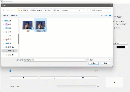
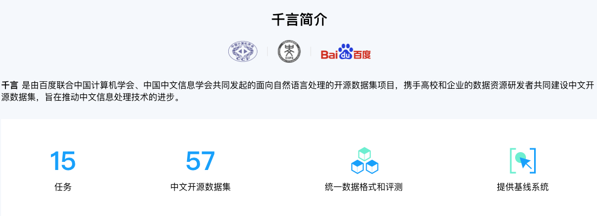

# EasyData

## 简介

EasyData旨在打造一套通用、领先且实用的数据自动扩充与数据质量优化工具库，并提供开源数据集与标注工具大全，助力开发者获得高质量的训练、推理数据，从而提升AI算法的实用效果。

Todo : 挑选并合成可视化的效果图。

[LDI数据质量提升效果图@崔程]

[EDA数据合成效果图@晓婷]

<table>
    <tr>
        <td></td>
        <td></td>
    <tr>
    <tr>    
         <td align="center">交互式智能视频标注工具</td>
         <td align="center">OCR领域多功能半自动化图形标注</td>
    <tr>
  
  
</table>

<table>
    <tr>
        <td></td>
    <tr>
    <tr>    
         <td align="center">交互式分割标注涵盖通用、人像、遥感、医疗、视频等功能</td>
    <tr>
  
  
</table>

<table>
    <tr>
        <td></td>
  
  <tr>
  <tr>
        <td></td>
  
  <tr>
   
   <tr>    
         <td align="center">涵盖CV、NLP、Speech多个方向的数据集</td>
        
  <tr>
  
  
</table>

## 📣 近期更新

Todo: 参照PaddleOCR等套件，补齐直播预告和工具说明

- **💥 直播预告**
💥 直播预告：11.22-11.23日每晚8点半，EasyData研发团队详解数据质量提升策略和数据合成工具。微信扫描下方二维码，关注公众号并填写问卷后进入官方交流群，获取EasyData优质项目合集，获取发布最新资讯。

 

- **🔥2022.11 发布 EasyData beta/0.5**
  - 发布数据质量提升工具，包括图像方向矫正、低质图像过滤能力，使用该工具可以在多个视觉任务中提升效果。
  - 发布数据合成工具@晓婷
  - 新增CV、NLP、Speech方向的50+[数据集](docs/zh_CN/datasets/dataset.md)，6+[自研半自动标注工具](docs/zh_CN/datasets/dataset.md)

## ⚡ 快速开始

- [数据质量提升快速体验](docs/zh_CN/PP-LDI/quick_start.md)
- 数据合成工具快速体验@晓婷
- [开源数据集和标注工具大全](docs/zh_CN/datasets/dataset.md)

## 👫 开源社区
- **📑项目合作：** 如果您是企业开发者且有明确的EasyData应用需求，填写[问卷链接待更新]()后可免费与官方团队展开不同层次的合作。
- **👫加入社区：** 微信扫描二维码并填写问卷之后，加入交流群与EasyData研发工程师1V1交流  
- **🎁社区共建**：EasyData欢迎与大家一起打造行业把数据治理打造成业界的新标准

## 🛠️ EasyData模型列表（更新中）

数据质量提升：

| 类别 | 亮点 | 文档说明 | 模型下载 |
| :--: | :--: | :------: | :------: |
|图像方向矫正|自动矫正图像，大大提升多项视觉任务在旋转图像上精度|[文档](docs/zh_CN/PP-LDI/image_orientation_correction.md)|[下载链接](@tingquan)|
|模糊图像过滤|判断图像是否模糊，可以广泛应用于模糊图像过滤、视觉相关业务的前处理等|[文档](docs/zh_CN/PP-LDI/low_quality_image_filtering.md)|[下载链接](@tingquan)|
|广告码图像过滤|判断图像是否含有二维码、条形码、小程序码，可以广泛应用于广告码过滤、审核等业务|[文档](docs/zh_CN/PP-LDI/low_quality_image_filtering.md)|[下载链接](@tingquan)|

数据扩充：

| 类别 | 亮点 | 文档说明 | 模型下载 |
| :--: | :--: | :------: | :------: |
|      |      |          |          |
|      |      |          |          |

## 📖 文档教程

- 运行环境准备 @晓婷
- Light-weight Data Improve 数据质量提升方案
  - [快速体验](docs/zh_CN/PP-LDI/quick_start.md)
  - 数据质量提升工具集
    - [图像方向校正工具](docs/zh_CN/PP-LDI/image_orientation_correction.md)
    - [低质图像过滤工具](docs/zh_CN/PP-LDI/low_quality_image_filtering.md)
- EasyDataAugment 数据扩充方案 @晓婷
  - [快速体验](docs/zh_CN/ppaug/quick_start.md)
  - [流程详解](docs/zh_CN/ppaug/EasyDataAug.md)
- [开源数据集](docs/zh_CN/datasets/dataset.md)
- [数据标注工具大全](docs/zh_CN/datasets/dataset.md)

- 许可证书

## 许可证书
本项目的发布受<a href="https://github.com/PaddlePaddle/PaddleOCR/blob/master/LICENSE">Apache 2.0 license</a>许可认证。
