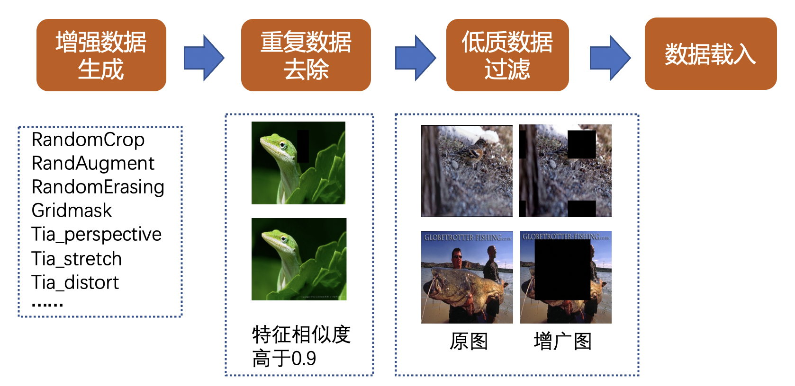

# Easy Data Augment

## 1. 简介

近几年很多方向的视觉任务取得了重大的进展，文本识别、目标检测、图像分类等领域均有表现优秀的算法。然而这些算法高度依赖训练数据的多样性，真实数据的标注需要耗费人力和时间成本。因此如何基于有限的数据扩充训练样本，是产业落地的关键问题。此外合成图像质量不一，质量过差或冗余数据过多都可能影响模型训练。如何保证合成数据的质量也是一大关键问题。
数据自动扩充工具 EDA（Easy Data Augment）旨在合成丰富、有效、精简的数据集，显著提升多个场景任务的效果。本文主要对EDA流程进行详细介绍。

## 2. 环境准备

推荐使用源码进行准备环境
```bash
git clone https://github.com/PaddlePaddle/EasyData.git
pip install -r requirements.txt
```
我们也提供了相应的whl包快速使用教程，参考[快速开始](./quick_start.md)

## 3. 数据准备
本项目主要以图像分类、文本识别为例进行讲解，并且提供了一些demo数据，位于[demo](../../../demo/)文件夹下。

图像分类数据集组织形式：
```
├── clas_data                                
│   ├── train    
│   ├── train_list.txt   
```
train_list.txt文件中默认请将图片路径和图片标签用 空格 分割，txt文件里的内容如下:

```
" 图像文件名 图像类别 "

train/xxxx1.jpg 0
train/xxxx2.jpg 1
...
```

文本识别数据集组织形式：
```
├── ocr_data                                
│   ├── images    
│   ├── train_list.txt   
```
train_list.txt文件中默认请将图片路径和图片标签用 \t 分割，txt文件里的内容如下:

```
" 图像文件名                 图像标注信息 "

images/xxxx1.jpg            简单可依赖
images/xxxx2.jpg        用科技让复杂的世界更简单
...
```


## 4. 数据自动扩充

在准备好环境和数据后，我们可以使用EDA工具进行数据扩充，EDA主要包含三个步骤：离线增强数据、低质数据过滤、重复数据过滤，下面依次进行介绍。



### 4.1 离线增强数据
数据增广普遍应用于训练阶段，且大都采用在线增广的形式来随机生成不同的增广图，但是在线增广图的质量却无法保证，对模型提升的精度有限。EDA 工具主要参考真实场景的训练数据，离线合成一批丰富有效的增广数据。该工具融合了裁剪类、变换类和擦除类的代表算法，如 RandomCrop, RandAugment, RandomErasing, Gridmask, Tia等。具体地，可以通过指定增广方式和增广数量来离线生成增广数据，以 ImageNet 分类数据集为例，使用 EDA 工具得到的离线增广效果图如下：


### 4.2 重复数据过滤
由于使用了多种增广方式，并且每种增广都具有一定的随机性，如增广的强度，增广的位置，因此大量生成离线增广数据可能会有重复数据，也即图像（特征）极其相似的增广图，不仅增广图和原始图片会产生重复数据，增广图之间也会产生重复，如下图所示：


可以看出，这些增广图具有很高的相似度，因此去除这些重复数据是很有必要的。具体地，我们采用[PP-ShiTu](https://github.com/PaddlePaddle/PaddleClas/blob/develop/docs/zh_CN/training/PP-ShiTu/feature_extraction.md)模型中的特征提取模块对离线增广的图像进行特征提取，然后将特征相似度高于一定阈值的增广数据进行剔除。为了便于去除所有可能的重复数据，我们使用原始数据和所有增广后的数据来构建全量特征检索库（gallery），然后依次对增广图进行特征查询（query），保留得分第二高的查询结果，如果得分大于阈值（如0.95），那么可以判定该数据为重复数据。

### 4.3 低质数据过滤
由于数据增广具有一定的随机性，离线增广后的数据可能会存在一些低质量的数据，这些数据会影响模型的性能，因此针对低质数据进行过滤是一个很有必要的步骤。具体地，我们采取场景中对应的大模型对离线增广的所有数据进行前向预测，将得分低于某个阈值的增广图进行去除。以 ImageNet 分类数据集为例，我们使用大模型（PPLCNet）来对离线增广后数据进行前向推理，去除分类得分小于0.2的增广数据，低质数据示例如下：


可以看出，图一为采用 RandomErasing 的增广图，关键区域（目标区域）几乎全部被擦除，图二为采用 Gridmask 的增广图，关键区域也被掩盖，这些图像都大大增加了模型学习的难度，因此我们需要对这些低质数据进行过滤。

完成对离线增广数据的重复数据过滤和低质数据过滤后便可进行模型的训练。

### 4.4 EDA 实战
在完成环境搭建和数据准备后，我们可以进行数据扩充，以图像分类为例，可以运行以下命令进行扩充数据：

```bash
python tools/predict.py -c deploy/configs/ppeda_clas.yaml 
```

`deploy/configs/ppeda_clas.yaml`配置文件解析:
首先是`DataGen`字段，该字段主要包含数据生成对应的参数

```
# 数据生成参数
DataGen: 
  ops: # 数据增强类型
    - randaugment
    - random_erasing
    - gridmask
    - tia_distort
    - tia_stretch
    - tia_perspective
  data_dir: "demo/clas_data" # 原始训练数据目录
  label_file: "demo/clas_data/train_list.txt" # 原始数据训练标签
  aug_file: "labels/test.txt" # 新生成的数据标签
  out_dir: "test" # 新生成的数据存储目录
  gen_ratio: 0 # 选择一定比例的原始数据进行生成
  gen_num: 5 # 指定每类增强生成的数量
  size: 224 # 图像resize的尺寸
```
其次是重复图像过滤字段`FeatureExtract`和`IndexProcess`，其中`FeatureExtract`字段主要包含特征提取模型对应的配置文件和重复图像过滤的阈值以及过滤后的标签保存路径，`IndexProcess`主要包含构建特征检索库的参数。
```
FeatureExtract:
  config: "deploy/configs/ppcv/feature_extract.yaml" # 特征提取模型对应的配置文件
  thresh: 0.5 # 重复图像过滤的阈值
  file_out: "tmp/rm_repeat.txt" # 重复图像过滤后的标签保存路径

IndexProcess:
  index_method: "HNSW32" # supported: HNSW32, IVF, Flat
  image_root: "./test" # 新生成的数据存储目录
  index_dir: "./augdata/all_aug" # 构建索引库的存储目录
  data_file:  "./labels/test.txt" # 新生成的数据标签
  index_operation: "new" # suported: "append", "remove", "new"
  delimiter: " " # 标签分隔符
  dist_type: "IP"
  embedding_size: 512
  batch_size: 32
  return_k: 5
  score_thres: 0.5
```
最后是低质图像过滤字段`BigModel`，该字段主要包含大模型的配置文件和低质过滤的阈值等参数。
```
BigModel:
  model_type: cls  # support(cls / ocr)
  config: "deploy/configs/ppcv/big_model_classification.yaml" # 大模型对应的配置文件
  batch_size: 8
  thresh: 0.1 # 低质过滤的阈值
  final_label: "high_socre_label.txt" # 最终过滤后的有效数据标签路径
```

如果需要适配自己的数据集，可以更改`DataGen`字段参数，主要涉及`data_dir`，`label_file`这两个参数，分别对应原始数据集目录和原始数据集标签路径。

最终生成的有效数据路径在`DataGen.out_dir`字段下，也即默认的`test`目录，对应的数据标签为`BigModel.final_label`字段，也即默认的 `high_socre_label.txt`文件。之后便可将该增广后的有效数据和原始数据进行合并一起训练。

如需使用其他场景，更换对应的配置文件即可，不同场景对应配置文件如下：

| 场景    | 配置文件 |
| :--: | :--: |
| 图像分类 |[ppeda_clas.yaml](../../../deploy/configs/ppeda_clas.yaml)|
| 文本识别 |[ppeda_ocr.yaml](../../../deploy/configs/ppeda_ocr.yaml)|
| 图像识别 |[ppeda_shitu.yaml](../../../deploy/configs/ppeda_shitu.yaml)|


## 5. EDA实验效果
为了验证 EDA 离线增广数据的效果，我们在不同的场景下进行分别验证，包含图像分类、文本识别、整图方向分类、二维码审核等场景，为了消除数据量变化带来的影响，我们会将原始数据进行复制多份作为baseline，具体实验结果如下表：

| 实验任务 | baseline | 增广后 |数据量对比|
| :--: | :--: | :------: | :------: |
|  文本识别    |   72.95%   |   74.15% (+1.20%)  | baseline：原始数据量复制6倍，增广后：约为原始数据量的2倍 | 
|  图像分类（PPLCNet）    |   80.10%   |   84.47% (+4.37%)  | baseline：原始数据量复制2倍，增广后：约为原始数据量的2倍 |
|  图像分类（PPHGNet）    |   90.80%   |   91.33% (+0.53%)  | baseline：原始数据量复制2倍，增广后：约为原始数据量的2倍 | 
|  识图任务    |   66.80%   |   67.70% (+0.90%)  | baseline：原始数据量复制6倍，增广后：约为原始数据量的2倍 |
|  整图方向分类 |   89.90%   |   90.12% (+0.22%)  | baseline：原始数据量复制2倍，增广后：约为原始数据量的1.6倍 | 
|  二维码审核   |   95.29%   |   95.73% (+0.44%)  | baseline：原始数据量复制6倍，增广后：约为原始数据量的2.5倍 | 

可以看出，使用 EDA 工具对数据进行增广后在不同场景中都有不同程度的效果提升。

### 5.1 实验任务说明

**文本识别**

文本识别任务是OCR的一个子任务，主要负责识别文本行的内容。我们基于[PaddleOCR](https://github.com/PaddlePaddle/PaddleOCR/tree/release/2.6)中的[PP-OCRv3中文识别模型](https://github.com/PaddlePaddle/PaddleOCR/blob/release/2.6/configs/rec/PP-OCRv3/ch_PP-OCRv3_rec.yml)配置进行验证，数据集采用中英文数据集，约26W。在使用EDA进行扩充数据后，便可将该增广后的有效数据和原始数据进行合并一起训练，具体训练步骤可参考[文本识别训练](https://github.com/PaddlePaddle/PaddleOCR/blob/release/2.6/doc/doc_ch/recognition.md)。由于数据量较大，我们缩减了训练轮数到200epoch。

**图像分类**

图像分类任务是计算机视觉中最基本的任务，主要对图像进行类别分类。我们基于[PaddleClas](https://github.com/PaddlePaddle/PaddleClas/tree/release/2.5)中的[PPLCNet分类模型](https://github.com/PaddlePaddle/PaddleClas/blob/release/2.5/ppcls/configs/ImageNet/PPLCNet/PPLCNet_x1_0.yaml)配置进行验证，数据集采用ImageNet的子集，共计5W。在使用EDA进行扩充数据后，便可将该增广后的有效数据和原始数据进行合并一起训练，具体训练步骤可参考[图像分类训练](https://github.com/PaddlePaddle/PaddleClas/blob/release/2.5/docs/zh_CN/training/single_label_classification/training.md)。

**识图任务**

识图任务是基于[PP-ShiTu系统](https://github.com/PaddlePaddle/PaddleClas/blob/release/2.5/docs/zh_CN/models/PP-ShiTu/README.md#pp-shitu-v2%E5%9B%BE%E5%83%8F%E8%AF%86%E5%88%AB%E7%B3%BB%E7%BB%9F)，它是一个实用轻量级通用图像识别系统，包含主体检测、特征提取、向量检索三个步骤。该任务我们主要进行特征提取阶段的模型训练，基于[PaddleClas](https://github.com/PaddlePaddle/PaddleClas/tree/release/2.5)中的[PPLCNetV2识别模型](https://github.com/PaddlePaddle/PaddleClas/blob/release/2.5/ppcls/configs/GeneralRecognitionV2/GeneralRecognitionV2_PPLCNetV2_base.yaml)配置进行验证，数据集约10W。在使用EDA进行扩充数据后，便可将该增广后的有效数据和原始数据进行合并一起训练，具体训练步骤参考[特征提取训练](https://github.com/PaddlePaddle/PaddleClas/blob/release/2.5/docs/zh_CN/training/PP-ShiTu/feature_extraction.md)。

**整图方向分类**

该任务是实用轻量图像分类解决方案（PULC, Practical Ultra Lightweight Classification）的一个应用场景，主要是对一张图像的方向进行分类，我们
基于[PaddleClas](https://github.com/PaddlePaddle/PaddleClas/tree/release/2.5)中的[PULC整图方向分类模型](https://github.com/PaddlePaddle/PaddleClas/blob/develop/ppcls/configs/PULC/image_orientation/PPLCNet_x1_0.yaml)配置进行验证，数据集采用ImageNet1k数据和部分标注的文本数据，约136.5W。在使用EDA进行扩充数据后，便可将该增广后的有效数据和原始数据进行合并一起训练，具体训练步骤参考[图像方向分类训练]()@崔程。由于数据量较大，我们缩减了训练轮数为20epoch。

**二维码审核**

该任务也是实用轻量图像分类解决方案（PULC, Practical Ultra Lightweight Classification）的一个应用场景，主要是对一张图像中是否含有二维码、条形码等进行分类，我们基于[PaddleClas](https://github.com/PaddlePaddle/PaddleClas/tree/release/2.5)中的[PULC二维码审核模型](https://github.com/PaddlePaddle/PaddleClas/blob/develop/ppcls/configs/PULC/code_exists/PPLCNet_x1_0.yaml)配置进行验证，数据集，约4W。在使用EDA进行扩充数据后，便可将该增广后的有效数据和原始数据进行合并一起训练，具体训练步骤参考[二维码审核训练]()@崔程
