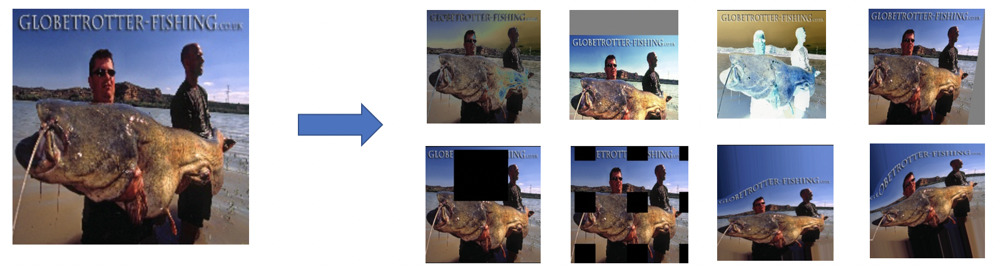
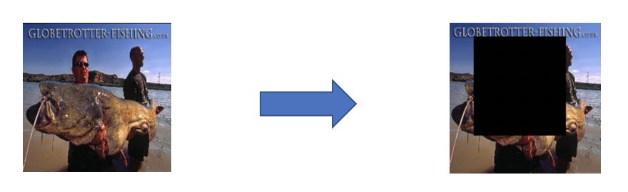
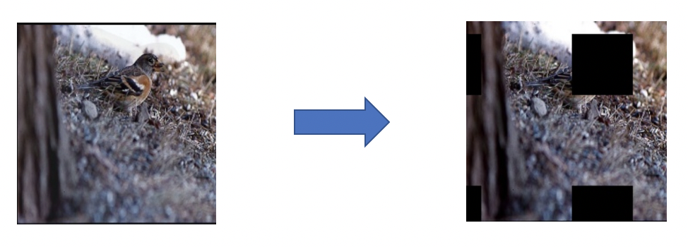
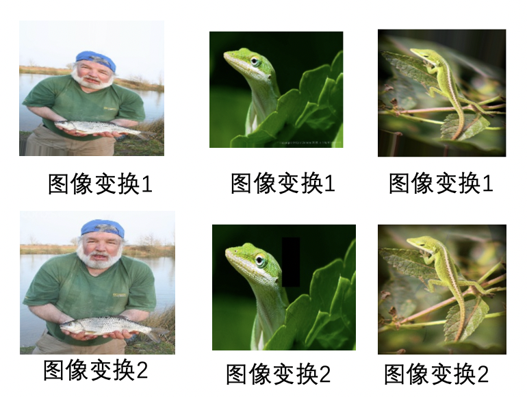

# Easy Data Augment

## 1. 简介

近几年很多方向的视觉任务取得了重大的进展，文本识别、目标检测、图像分类等领域均有表现优秀的算法。然而这些算法高度依赖训练数据的多样性，真实数据的标注需要耗费人力和时间成本。因此如何基于有限的数据扩充训练样本，是产业落地的关键问题。此外合成图像质量不一，质量过差或冗余数据过多都可能影响模型训练。如何保证合成数据的质量也是一大关键问题。
数据自动扩充工具 EDA（Easy Data Augment）旨在合成丰富、有效、精简的数据集，显著提升多个场景任务的效果。

## 2. 流程详解

### 2.1 离线增强数据
数据增广普遍应用于训练阶段，且大都采用在线增广的形式来随机生成不同的增广图，但是在线增广图的质量却无法保证，对模型提升的精度有限。EDA 工具主要参考真实场景的训练数据，离线合成一批丰富有效的增广数据。该工具融合了裁剪类、变换类和擦除类的代表算法，如 RandomCrop, RandAugment, RandomErasing, Gridmask, Tia等。具体地，可以通过指定增广方式和增广数量来离线生成增广数据，以 ImageNet 分类数据集为例，使用 EDA 工具得到的离线增广效果图如下：

### 2.2 低质数据过滤
离线增广后的数据可能会存在一些低质量的数据，这些数据会影响模型的性能，因此针对低质数据进行过滤是一个很有必要的步骤。具体地，我们采取场景中对应的大模型对离线增广的所有数据进行前向预测，将得分低于某个阈值的增广图进行去除。以 ImageNet 分类数据集为例，我们使用大模型（ResNet?）来对离线增广后数据进行前向推理，去除分类得分小于0.2的增广数据，低质数据示例如下：

可以看出，图一为采用 RandomErasing 的增广图，关键区域（目标区域）几乎全部被擦除，图二为采用 Gridmask 的增广图，关键区域也被掩盖，这些图像都大大增加了模型学习的难度，因此我们需要对这些低质数据进行过滤。

### 2.3 重复数据过滤
由于使用了多种增广方式，并且每种增广都具有一定的随机性，如增广的强度，增广的位置，因此大量生成离线增广数据可能会有重复数据，也即图像（特征）极其相似的增广图，不仅增广图和原始图片会产生重复数据，增广图之间也会产生重复，如下图所示：

可以看出，这些增广图具有很高的相似度，因此去除这些重复数据是很有必要的。具体地，我们采用[PP-ShiTu](https://github.com/PaddlePaddle/PaddleClas/blob/develop/docs/zh_CN/training/PP-ShiTu/feature_extraction.md)模型中的特征提取模块对离线增广的图像进行特征提取，然后将特征相似度高于一定阈值的增广数据进行剔除。为了便于去除所有可能的重复数据，我们使用原始数据和所有增广后的数据来构建全量特征检索库（gallery），然后依次对增广图进行特征查询（query），保留得分第二高的查询结果，如果得分大于阈值（如0.95），那么可以判定该数据为重复数据。

完成对离线增广数据的低质过滤和重复数据过滤后便可进行模型的训练。

## 3. 实验效果
为了验证 EDA 离线增广数据的效果，我们在不同的场景下进行分别验证，包含图像分类、文本识别、整图方向分类、二维码审核等场景，具体实验结果如下表：

| 实验任务 | 原始数据集 | 增广后数据集 |
| :--: | :--: | :------: |
|  文本识别    |   71.39%   |   75.18% (+3.79%)  |
|  图像分类    |   80.10%   |   84.47% (+4.37%)  |
|  识图任务    |   65.50%   |   68.10% (+2.60%)  |
|  整图方向分类 |   88.70%   |   90.12% (+1.42%)  |
|  二维码审核   |   94.40%   |   95.73% (+1.33%)  |

可以看出，使用 EDA 工具对数据进行增广后在不同场景中都有不同程度的效果提升。

**实验任务说明**

文本识别：基于[PaddleOCR](https://github.com/PaddlePaddle/PaddleOCR/tree/release/2.6)中的[PP-OCRv3中文识别模型](https://github.com/PaddlePaddle/PaddleOCR/blob/release/2.6/configs/rec/PP-OCRv3/ch_PP-OCRv3_rec.yml)

图像分类：基于[PaddleClas](https://github.com/PaddlePaddle/PaddleClas/tree/release/2.5)中的[PPLCNetV2分类模型](https://github.com/PaddlePaddle/PaddleClas/blob/release/2.5/ppcls/configs/ImageNet/PPLCNetV2/PPLCNetV2_base.yaml)

识图任务：基于[PaddleClas](https://github.com/PaddlePaddle/PaddleClas/tree/release/2.5)中的[PPLCNetV2识别模型](https://github.com/PaddlePaddle/PaddleClas/blob/release/2.5/ppcls/configs/GeneralRecognitionV2/GeneralRecognitionV2_PPLCNetV2_base.yaml)

整图方向分类：基于[PaddleClas](https://github.com/PaddlePaddle/PaddleClas/tree/release/2.5)中的[PULC整图方向分类模型](https://github.com/PaddlePaddle/PaddleClas/blob/develop/ppcls/configs/PULC/image_orientation/PPLCNet_x1_0.yaml)

二维码审核：基于[PaddleClas](https://github.com/PaddlePaddle/PaddleClas/tree/release/2.5)中的[PULC二维码审核模型](https://github.com/PaddlePaddle/PaddleClas/blob/develop/ppcls/configs/PULC/code_exists/PPLCNet_x1_0.yaml)

部分实验任务由于数据集过大，因此调整了训练epoch数便于快速验证。